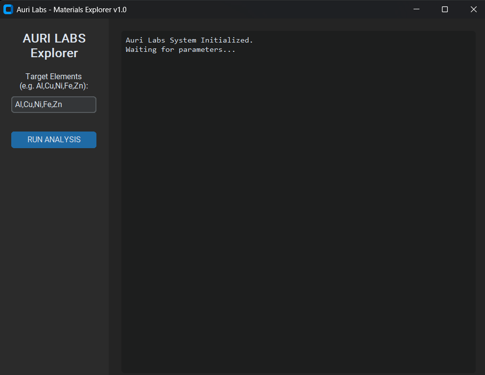

# Auri Labs: Deep-Sea High-Entropy Alloy (HEA) Explorer 🌊

> **Note on Intellectual Property:** The source code for the proprietary Python API pipeline is kept private to protect Auri Labs' trade secrets. This repository serves as a technical whitepaper outlining the methodology, physics, and validation steps of the project.

## Project Overview
A computational materials science pipeline designed to discover and filter thermodynamically stable, low-melting-point eutectic High-Entropy Alloys (HEAs) for extreme deep-sea environments. Developed in parallel with ongoing flexible Thermoelectric Generator (TEG) research, this project bridges the gap between big data materials informatics and physical at-home laboratory synthesis.

## Methodology & Synthesis Constraints
Instead of brute-force empirical testing, this project uses the Materials Project API to screen millions of combinations based on strict physical constraints:
1. **Thermodynamic Stability:** Filtering structures with an Energy Above Hull of `< 0.05 eV/atom`.
2. **Hardware Constraints:** Targeting base elements (e.g., Al, Cu, Ni, Fe) that undergo liquid phase dissolution below **1300°C**. This directly aligns with the operational limits of a custom 2500W ZVS induction heater used for physical casting.

## Crystallographic Validation (VESTA)
*(Insert your VESTA Al2FeNi visualization here)*  
*Figure 1: Crystallographic visualization of the Al2FeNi system showcasing intense lattice distortion and hybridization of d-orbitals, which acts as a quantum barrier against high hydrostatic pressure and deep-sea corrosion. Copyright © 2026 Auri Labs. All Rights Reserved.*

## Next Steps
1. **Simulation:** Importing crystallographic boundary data into **COMSOL Multiphysics** for structural and acoustic interaction testing under 50 MPa hydrostatic pressure.
2. **Physical Synthesis:** Physical casting of the selected alloys inside an Argon-shielded graphite crucible, followed by precipitation hardening in a custom thermal aging station.

---
---

# Türkçe Teknik Özet (Turkish Overview)

> **Fikri Mülkiyet Notu:** Auri Labs ticari sırlarını korumak amacıyla Python API altyapısının kaynak kodu gizli tutulmaktadır. Bu depo, projenin metodolojisini, fiziksel altyapısını ve doğrulama adımlarını sunan bir teknik izahname niteliğindedir.

## Proje Özeti
Aşırı basınçlı derin deniz ortamları için termodinamik olarak stabil ve düşük erime noktalı Yüksek Entropili Alaşımlar (HEA) keşfetmek amacıyla tasarlanmış hesaplamalı malzeme bilimi projesidir. Esnek Termoelektrik Jeneratör (TEG) AR-GE çalışmalarıyla paralel yürütülen bu proje, büyük veri analizi ile fiziksel atölye üretimini bir araya getirmektedir.

## Metodoloji ve Üretim Kısıtlamaları
Deneme-yanılma yöntemleri yerine, Materials Project API kullanılarak aşağıdaki kısıtlamalara göre veri madenciliği yapılmıştır:
1. **Termodinamik Stabilite:** Hull enerjisi `< 0.05 eV/atom` olan yapıların filtrelenmesi.
2. **Donanım Kısıtlamaları:** Maksimum **1300°C**'de sıvı fazda çözünme (liquid phase dissolution) gerçekleştirebilecek elementlerin (Al, Cu, Ni, Fe) seçilmesi. Bu sıcaklık sınırı, fiziksel sentezde kullanılacak olan 2500W ZVS indüksiyon fırınının kapasitesine göre özel olarak belirlenmiştir.

## Sonraki Adımlar
1. **Simülasyon:** VESTA'dan elde edilen atomik kafes verilerinin **COMSOL Multiphysics** ortamına aktarılarak 50 MPa hidrostatik basınç altında yapısal testlerinin yapılması.
2. **Fiziksel Üretim:** Seçilen alaşım adaylarının Argon korumalı grafit potada ZVS fırını ile dökülmesi ve özel tasarım termal yaşlandırma istasyonunda (aging station) sertleştirilmesi.
